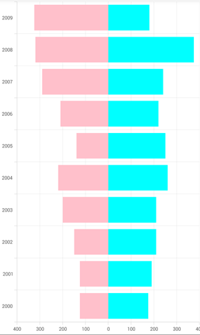

# How to create Tornado Chart in Xamarin.Forms

This demo explains how to create a tornado chart in Xamarin.Forms by using the existing chart types in Syncfusion [Xamarin.Forms Charts](https://help.syncfusion.com/xamarin/charts/getting-started). 

The tornado chart is a special type of bar chart. In tornado chart, the bars can be extended from the defined baseline and which is also used to compare data among different types of data or categories, the bars in the tornado chart are horizontal and this chart is basically used to show the impact such as how a condition will impact the result on the outcome.

You can achieve the tornado chart using the [bar charts](https://help.syncfusion.com/xamarin/charts/charttypes#bar-chart) as shown in the following code sample.

```
<!--Set SideBySideSeriesPlacement as false to avoid segments arranged in side by side-->
<chart:SfChart x:Name="chart" SideBySideSeriesPlacement="False">
          <chart:SfChart.PrimaryAxis>
                    <chart:CategoryAxis LabelPlacement="BetweenTicks"/>
          </chart:SfChart.PrimaryAxis>
          <chart:SfChart.SecondaryAxis>
                    <chart:NumericalAxis LabelCreated="SecondaryAxis_LabelCreated"/>
          </chart:SfChart.SecondaryAxis>
          <chart:BarSeries  XBindingPath="Year" YBindingPath="Export" Color="Aqua" 
                                  ItemsSource="{Binding Models}" />
          <chart:BarSeries  XBindingPath="Year" YBindingPath="Import" Color="Pink" 
                                  ItemsSource="{Binding Models}" />
</chart:SfChart>
```

```
void SecondaryAxis_LabelCreated (object sender, ChartAxisLabelEventArgs e)
{
       // Changes the negative values into absolute value.
       double label = Math.Abs (Convert.ToDouble(e.LabelContent));
       e.LabelContent = label.ToString ();
}
```

### Output
 


KB article - [How to create a Tornado Chart in Xamarin.Forms](https://www.syncfusion.com/kb/10684/how-to-create-a-tornado-chart-in-xamarin-forms)

### See also

[What are the different types of axis in Xamarin.Forms Charts](https://help.syncfusion.com/xamarin/charts/axis)

[How to add multiple series in Xamarin.Forms Chart](https://help.syncfusion.com/xamarin/charts/chartseries#multiple-series)

[How to show the provided information of the data points to user](https://help.syncfusion.com/xamarin/charts/datamarker)

[How to add the annotations in Xamarin.Forms Chart](https://help.syncfusion.com/xamarin/charts/chartannotation)
